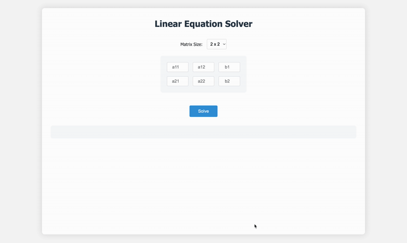

# Linear Equation Solver

A web-based application for solving systems of linear equations using the Gaussian elimination method with partial pivoting. The solver provides a step-by-step visualization of the solution process using LaTeX rendering.

## Features

- Interactive matrix input interface
- Support for 2x2, 3x3, and 4x4 systems of linear equations
- Step-by-step solution visualization
- Partial pivoting for numerical stability
- LaTeX rendering of matrices and equations
- Fraction representation for exact solutions
- Roman numeral notation for row operations

## Demo



## Installation

1. Clone the repository:
   ```bash
   git clone https://github.com/yourusername/LinearEquationSolver.git
   cd LinearEquationSolver
   ```

2. Install dependencies:
   ```bash
   npm install
   ```

3. Start the server:
   ```bash
   npm start
   ```

4. Open your browser and navigate to `http://localhost:3000`

## Usage

1. Select the matrix size (2x2, 3x3, or 4x4) from the dropdown menu
2. Enter the coefficients of your system of equations in the matrix
3. Enter the constants (b vector) in the rightmost column
4. Click "Solve" to see the step-by-step solution

## Example

For the system:
```
2x + y = 5
x - y = 1
```

The solver will:
1. Display the augmented matrix
2. Show each step of elimination
3. Perform back substitution
4. Present the final solution

## Contributing

Contributions are welcome! Please feel free to submit a Pull Request.

## License

This project is licensed under the MIT License - see the LICENSE file for details.